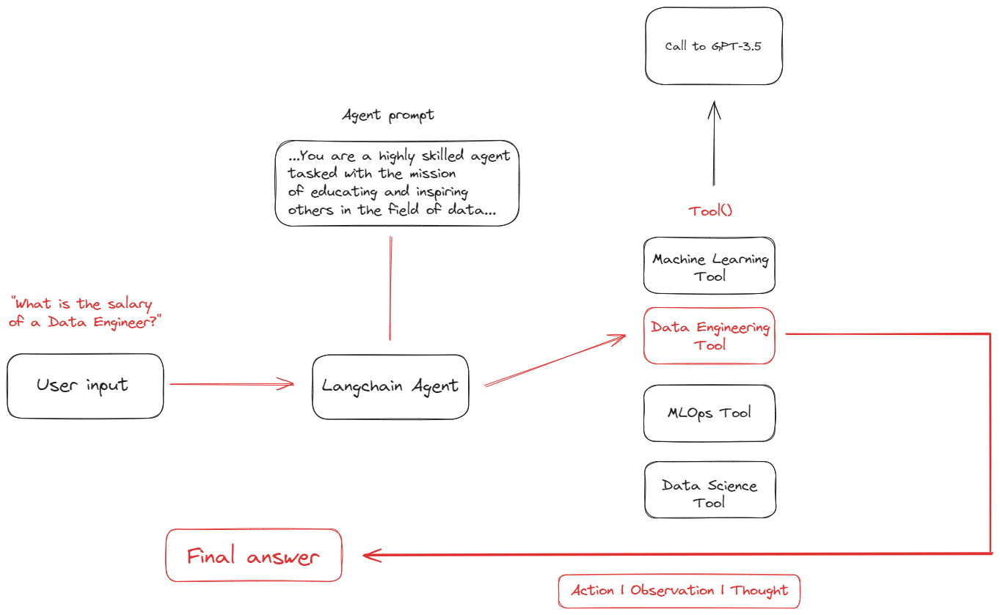

# Data Agent API with Langchain, Langchain Hub by LangSmith and FastAPI 

## Overview

This repository contains the code for an API developed to interface with a specialist agent in the field of data using Langchain, LangSmith for prompt versioning, and FastAPI. The agent is designed to provide in-depth responses to questions related to Machine Learning, Data Engineering, MLOps, and Data Science.

## Workflow


## Features

- **Specialist Knowledge Areas**: The API leverages specific templates for various domains, including Data Engineering, MLOps, Machine Learning Engineering, and Data Science.
- **Dynamic Prompt Templating**: Supports dynamic templating for prompts using Langchain and LangSmith, ensuring versatility and relevance of the responses.
- **Error Handling**: Robust error handling to manage and respond to execution failures.

## Installation

### Prerequisites

- Python 3.10+
- pip

### Setting Up Environment

1. Clone the repository:
   ```bash
   git clone https://github.com/yourusername/build_langsmith_agent_api.git
   cd build_langsmith_agent_api
   ```

2. Install the required dependencies:
   ```bash
   pip install -r requirements/requirements.txt
   ```

### Environment Variables

Set the following environment variables before running the API:
- `OPENAI_BASE`: Azure endpoint for OpenAI services.
- `OPENAI_VERSION`: API version for the OpenAI service.
- `OPENAI_KEY`: API key for accessing OpenAI services.
- `OPENAI_TYPE`: Type of OpenAI service (e.g., `chat`).
- `OPENAI_DEPLOYMENT_NAME`: Deployment name on Azure.

These variables can be set in your shell or through an environment file.

## Running the API

To run the API locally, use the following command:

```bash
uvicorn app.api:app --reload
```

The `--reload` option enables auto-reloading of the server on code changes.

## API Usage

### Endpoint: `/agent/invoke`

- **Method**: `POST`
- **Input**: JSON containing `input_text` field with the user's query.
- **Response**: JSON containing `model_response` field with the agent's response.

### Example Request

```bash
curl -X 'POST' \
  'http://localhost:8000/agent/invoke' \
  -H 'accept: application/json' \
  -H 'Content-Type: application/json' \
  -d '{"input_text": "What is MLOps?"}'
```

### Example Response

```json
{
  "model_response": "MLOps is a set of practices that aims to deploy and maintain machine learning models in production reliably and efficiently. The MLOps practices involve automation and monitoring at all steps of ML system construction, including integration, testing, releasing, deployment, and infrastructure management."
}
```

## Deployment

Refer to the `deployment` directory for Docker and Kubernetes configurations to deploy the API to a production environment.

### Docker

Build and run the Docker container using:
```bash
docker build -t langsmith-agent-api ./deployment/docker
docker run -p 8000:8000 langsmith-agent-api
```

### Kubernetes

Apply the Kubernetes configurations:
```bash
kubectl apply -f deployment/kubernetes
```

## Contributing

Contributions are welcome! Please feel free to submit pull requests or open issues to propose changes or add features.
